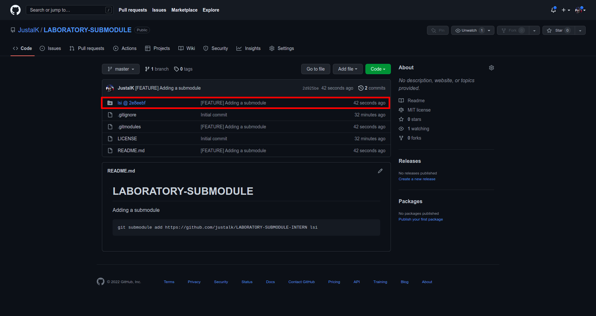

# LABORATORY-SUBMODULE


Adding a submodule
```
git submodule add https://github.com/justalk/LABORATORY-SUBMODULE-INTERN lsi
```

If I click on the red folder I will be redirected to my other repository
