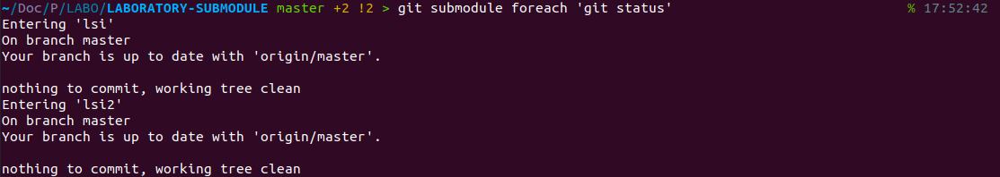

# LABORATORY-SUBMODULE

This laboratory is a test about **submodule in Git**. I have discovered the term recently when I try to push a repository inside a repository when I was working on GitHub and GitLab in the same folder. I wanted to try what is it about and how it works. It's a small feature from Git but it's still interesting to learn new things.

## Adding a submodule

For adding a submodule in our repository, I connected using the link to the repository and the command below. Once entered, the entire repository will be downloaded in the `lsi` folder. I try to create an other one using the same command but changing the destination folder to `lsi2`. It's possible to have multiple time the same directory and on different commit.

```bash
$ git submodule add https://github.com/justalk/LABORATORY-SUBMODULE-INTERN lsi
```

If I look on Github, I can see my folder with an arrow icone. If I click on the red folder I will be redirected to my other repository.


## Few notes

- If my submodule has a change, I need to go in the directory for pulling the change. Doing a git pull inside the parent repository wont trigger the pull on the submodule.
- I can make modification in the lsi folder as if it was a normal repository. I can push my change normaly if I make modification in `lsi`

## Submodule commands

You can run git command on every submodule by using the `foreach` commands. By example, If I want to pull the latest commit from every submodule:

```bash
$ git submodule foreach 'git pull'
```

